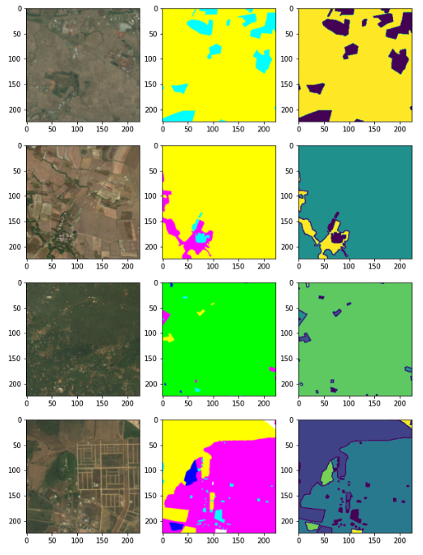
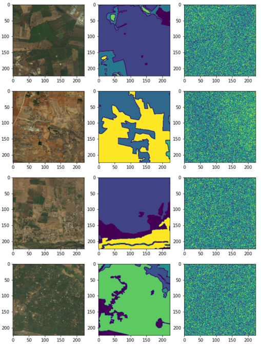
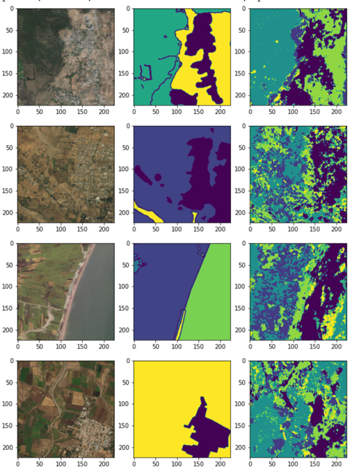
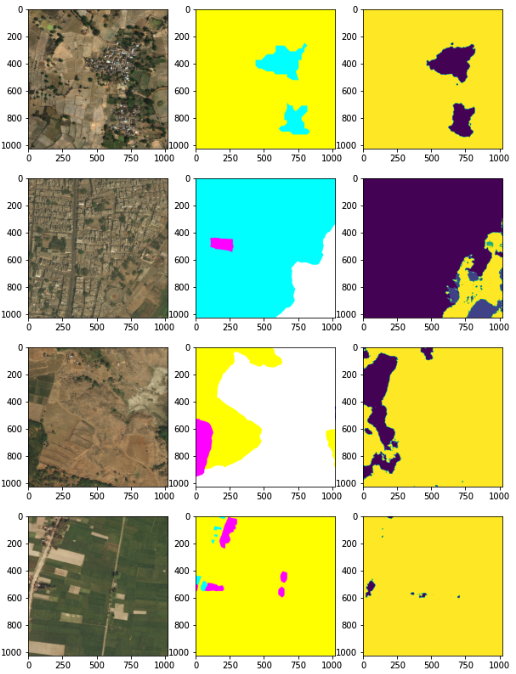

# SegNet: PyTorch Implementation for DeepGlobe Land Classification
***
This repository contains the SegNet model implemented in PyTorch. This model is an Encoder-Decoder Architecture 
based model, used specifically for Semantic Segmentation. The model is used specifically on DeepGlobe Land 
Classification Dataset.

## Information and Resource URL's
***
**SegNet URL: [SegNet: Deep Convolutional Encoder-Decoder Architecture for Image Segmentation](https://arxiv.org/abs/1511.00561)**  
**DeepGlobe URL: [DeepGlobe: CVPR-2018 Satellite Challenge](http://deepglobe.org)** 
**Implementation Framework: [PyTorch](https://pytorch.org)**

## Purpose Of The Execution
***
1. First main objective of working on this model is to understand Semantic Segmentation and getting a hands-on 
   experience using Neural Networks and PyTorch as a framework.
2. Practically understand the effects of Learning Rate, Momentum, Regularization and similar optimizations.
3. On top of learning the methodologies, making an impact in terms of improving the environment is an utmost priority. 
   Through this project, understanding the landscapes and classifying them can further help in harnessing renewable 
   resources and will also help in the development of low-income countries by further helping to improve and adapt the 
   services based on the geographical landscape. 
   
## Requirements
***
1. PyTorch 1.9
2. Matplotlib
3. PIL
4. Some other libraries. It can be found by analysing the errors (if any) at the time of code execution. 

## Preparation
***
1. Download the dataset from [Land Classification Dataset](http://deepglobe.org/challenge.html).
2. Change the path of the directories in following files: 
   a. DataConfiguration.py  
   b. Test.py  
3. Make sure to have ample disk space available for saving the model checkpoints and best model.  
4. As SegNet is based on VGG (13 Layer Network), thus for less tuning and quick execution, pretrained VGG-13 network can
   be also used. In order to do that, uncomment the import statement of pretrained VGG13 and comment that of VGG13
   in the following files:  
   a. Train.py
> **NOTE:** More Information on how to work with pretrained networks can be fetched from:  
> 1. [PyTorch Models](https://pytorch.org/vision/stable/models.html)
> 2. [PyTorch VGG Network](https://pytorch.org/hub/pytorch_vision_vgg/)
> 3. [Model Finetuning](https://pytorch.org/tutorials/beginner/finetuning_torchvision_models_tutorial.html)
> 4. [Transfer Learning](https://debuggercafe.com/transfer-learning-with-pytorch/)
5. Another important step to keep in mind is that this code is for Multi-Class Classification. Therefore, adapt your 
   code according to the number of classes to be predicted along with the number of features required per layer.
> **NOTE:** This code is not specific to [Land Classification Dataset](http://deepglobe.org/challenge.html). It can be 
  used with any dataset as required. However, few parts present in the code (For example: One-Hot Encoding, 
  Semantic Masks, Visualization might have to be changed according to the data this model is being applied for.)

## Model Training and Code Execution
***
Run **Execution.py** in order to train the model and subsequently test the trained model. 

## Visualization
***
### Dataset: Raw Image - Image Mask - One-Hot Encoded Mask

### Network Prediction
#### Initial Epochs

#### Subsequent Epochs

#### Trained Model

